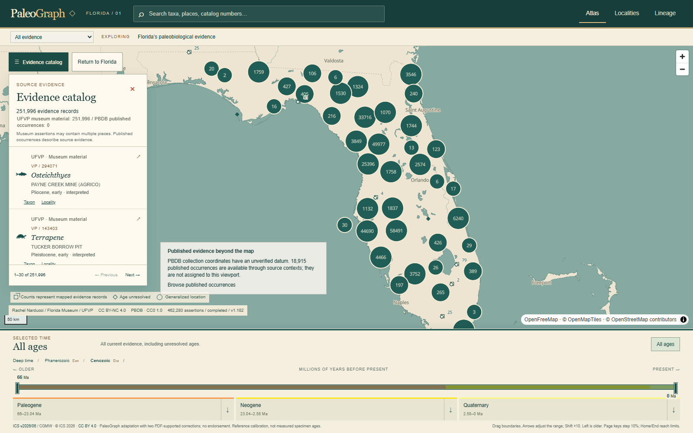
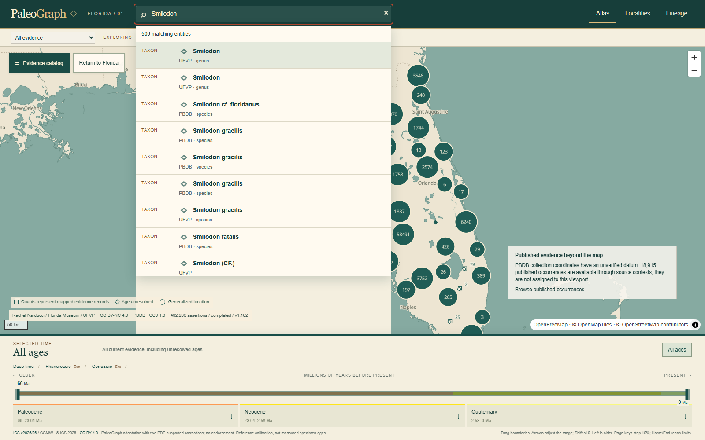
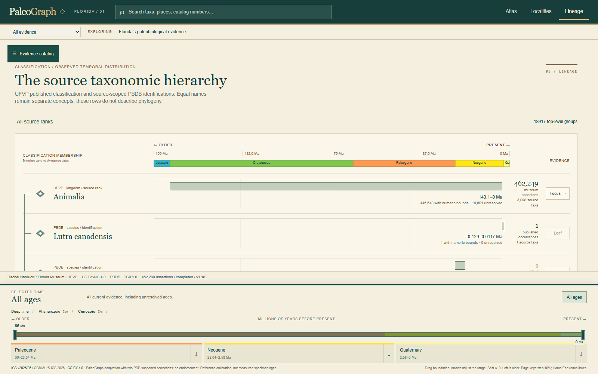
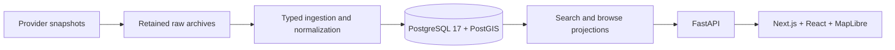

# PaleoGraph

A provenance-aware paleobiology atlas integrating museum material and published occurrence evidence while preserving source identity, uncertainty, taxonomy, temporal interpretation, and the evidence behind each record.



## What it does

Explore Florida's fossil evidence through an interactive Atlas, locality dossiers, source taxonomic classifications, geological time selection, and a shared evidence catalog. Search taxa, places, and catalog numbers; inspect identifications, age evidence, source revisions, and explicit bibliographic relationships.

The validated local scientific dataset contains **462,280 UFVP records**, **18,915 Florida PBDB occurrences**, and **1,118 PBDB collections**. Museum catalog assertions can describe multiple pieces. Published occurrences remain distinct from physical specimens; PBDB ingestion creates **zero canonical Specimens**.

| Search across sources | Observed evidence through time |
| --- | --- |
|  |  |

## Engineering highlights

- Versioned source records and normalized evidence preserve original assertions, revision hashes, interpretation policies, and complete dependency proofs.
- PostgreSQL search and indexed read projections support discovery with a single relational system of record.
- Atomic publication, resumable disk staging, immutable content-addressed archives, and replay detection support ingestion beyond in-memory dataset sizes.
- Typed contracts, URL-restorable context, cancellation, buffered map coverage, and stale-response rejection keep navigation coherent.
- Unit, database, migration, and Chromium tests exercise the real frontend/API boundary with isolated fixtures and disposable databases.

## Architecture



Design C separates cold raw archives from queryable normalized evidence while retaining source/revision identity and complete proofs. Projections are rebuildable read optimizations; they do not replace scientific evidence. See [architecture](docs/architecture.md) and [data model](docs/data-model.md).

## Scientific integrity

Occurrence is distinct from specimen; taxonomy is distinct from phylogeny. Source assertions remain separate from PaleoGraph interpretation. Source numeric ages remain separate from derived reference envelopes; uncertainty and qualifiers remain visible. Reconciliation candidates do not establish deterministic identity.

Lineage shows observed source-supported material and occurrence evidence through time. It does not establish evolutionary origin, divergence, extinction timing, or complete geographic range. **PBDB coordinates are withheld from Atlas until datum/CRS semantics are sufficiently verified**; occurrences remain available through nonspatial browsing. See [scientific semantics](docs/scientific-semantics.md).

## Performance

Representative local database paths improved from approximately 2.4 s to 136 ms for cold locality browsing, 191 ms to 17 ms warm, 525 ms to 14 ms for warm taxonomy browsing, and 4.18 s to 66–71 ms for the Florida PBDB catalog. Scale-fixture occurrence detail/reference reads measured approximately 6/14 ms warm. These are development measurements, not network latency or production SLAs; broad fixture discovery remains slower. [Measurement scope](docs/performance.md) explains the datasets and limits.

## Technology stack

Next.js, React, TypeScript, MapLibre GL, FastAPI, Pydantic, SQLAlchemy, PostgreSQL 17, PostGIS, Alembic, Docker Compose, uv, pnpm, pytest, and Playwright/Chromium.

## Running locally

Requires Node.js 24, Python 3.12, pnpm 10.34.6, uv, and Docker with Compose. Run commands from the repository root. The default configuration is local development only and binds PostgreSQL to loopback.

1. Copy `.env.example` to `.env` (`cp .env.example .env` on Unix; `Copy-Item .env.example .env` in PowerShell).
2. Install dependencies and initialize the database:

   ```sh
   pnpm install --frozen-lockfile
   uv sync --project apps/api --locked
   docker compose up -d --wait db
   uv run --project apps/api alembic -c apps/api/alembic.ini upgrade head
   uv run --project apps/api python -m app.db
   ```

3. Load the small attributed offline UFVP fixture for a preview:

   ```sh
   uv run --project apps/api python scripts/prepare_ufvp_fixture.py
   uv run --project apps/api python -m app.ingestion.import_ufvp --archive data/raw/ufvp-offline-fixture.zip --limit 8
   ```

4. In separate terminals start the API and frontend:

   ```sh
   uv run --project apps/api uvicorn app.main:app --reload --reload-dir apps/api/app
   pnpm dev
   ```

Open [localhost:3000](http://localhost:3000); API documentation is at [localhost:8000/docs](http://localhost:8000/docs). A fresh clone contains code and small fixtures, **not** the complete scientific dataset shown in screenshots. The eight-row preview is intentionally limited. Map tiles/fonts require OpenFreeMap network access; set `NEXT_PUBLIC_MAP_STYLE_URL` blank to disable the basemap.

Compose, FastAPI and Next.js share the root `.env`; process environment overrides it. Optional `PALEOGRAPH_DATA_ROOT` selects bulk storage; ordinary preview/testing needs no custom storage configuration. `docker compose down` stops the local database and preserves its volume.

## Testing

```sh
pnpm lint
pnpm typecheck
pnpm test
pnpm build
uv run --project apps/api ruff check apps/api scripts
uv run --project apps/api ruff format --check apps/api scripts
uv run --project apps/api mypy --config-file apps/api/pyproject.toml apps/api/app
uv run --project apps/api pytest apps/api/tests -m "not integration"
uv run --project apps/api python scripts/test_db.py
pnpm --filter @paleograph/web exec playwright install chromium
uv run --project apps/api python scripts/test_browser.py
```

Database tests include repeatable upgrades, downgrade/upgrade, schema drift, and integration tests in a dedicated disposable Compose project. Browser tests build and launch the actual API and production frontend against a separate fixture database. These runners never target the ordinary database. Linux may need `playwright install --with-deps chromium`. See [contribution guidelines](CONTRIBUTING.md).

## Data sources and licensing

Original PaleoGraph software is licensed under the [GNU Affero General Public License version 3](LICENSE), SPDX **AGPL-3.0-only**. Copyright (c) 2026 PaleoGraph contributors. This does **not** relicense scientific data, images, publications, or reference materials.

| Content | Retained source rights |
| --- | --- |
| UFVP v1.182 data and eight-row fixture | CC BY-NC 4.0; attribution and noncommercial use |
| PBDB retained public responses | Response metadata identifies CC0 1.0; preserve source and reference attribution |
| ICS 2026/06 reference and chart details | CC BY 4.0; attributed adaptation |
| Museum images, basemap assets, publications | Their own terms; the software license does not replace these rights |

Read [data sources and rights](docs/data-sources.md) before redistributing source content. Screenshot attribution remains intact; no provider endorsement is implied.

## Known limitations

Coverage reflects retained snapshots and their omissions. Missing evidence does not prove biological absence. Equal names do not merge source taxon concepts or localities. Florida reconciliation has 326 assessments, 117 candidate edges, and zero deterministic links. Broad discovery at large scale needs further performance work. PBDB positions are not mapped, and decorative icons are not scientific specimen imagery.

## Current status

Florida multi-source browsing is implemented and locally validated. Global PBDB ingestion architecture has been validated with a retained scale fixture containing 1,507,657 typed source records, 262,144 occurrences, and 29,982,936 proof edges, including replay, recovery, and coupled database/archive restore. **The actual global PBDB import has not been performed.** This is a development application; no production deployment is claimed.
