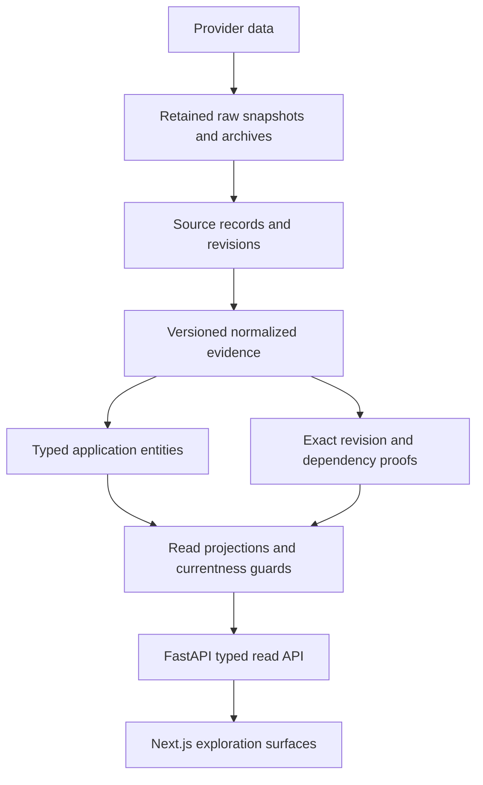

# Architecture

PaleoGraph is a monorepo with a Next.js/React/TypeScript frontend, FastAPI API, and PostgreSQL 17/PostGIS system of record. Pydantic validates contracts; SQLAlchemy provides request-scoped database access; Alembic owns migrations. Docker Compose supplies local and disposable test databases.

## Evidence to discovery

Not every assertion becomes a canonical entity. Bibliography, opinions, measurements and material evidence retain typed roles. Source assertions, adapter interpretation and discovery are separate layers. See [data model](data-model.md).

| Location | Responsibility |
| --- | --- |
| `apps/web/lib/api` | Typed contracts and sanitized fetch boundary |
| `apps/web/features/explore` | URL state, catalog, search, inspection and relationships |
| `apps/web/features/map`, `features/timeline` | Persistent map, buffered coverage and time selection |
| `apps/api/app/explore`, `app/discovery` | Evidence reads, policy and indexed discovery |
| `apps/api/app/ingestion` | UFVP/PBDB adapters, archives, staging and publication |
| `apps/api/app/reconciliation.py` | Reversible material assessments |
| `apps/api/app/models.py`, `apps/api/migrations` | Relational model and schema |
| `scripts/` | Disposable test runners, fixtures and archive audit |

## Storage and ingestion

Design C keeps compressed immutable provider payloads in a content-addressed archive store outside hot PostgreSQL. PostgreSQL retains source/revision identities, archive pointers, lean normalized evidence, and complete version/dependency proofs. Existing inline revisions remain supported; raw reads resolve actual storage mode and fail explicitly when cold evidence is absent or corrupt.

Publication verifies object hashes and writes a READY manifest last. SQLite staging bounds memory and records resumable progress; PostgreSQL COPY and set-based publication prepare a private staging schema. Only completed, verified staging can atomically become the current scientific read revision. Identities survive replay and changed snapshots; prior revisions remain recoverable. Exact replay performs no scientific replacement. Coupled database/archive restore recovers cold evidence: a database dump alone cannot prove availability. There is no automatic archive garbage collection or upstream substitution for missing historical bytes.

The pipeline has been exercised with retained and explicitly synthetic scale fixtures. The actual global PBDB dataset has not been imported. Normal-target global publication requires a restore-verified checkpoint; CI never runs global ingestion. The current archive store uses local files, not a deployed cloud service.

## Read paths and coherence

Search uses PostgreSQL full-text search, `pg_trgm`, and indexed exact/prefix access. Catalog pages select eligible identities before expanding details. B-tree and GiST indexes support relational and spatial access. There is no OpenSearch, Neo4j, Redis or Kafka requirement.

Catalog membership, source-current pointers, policy IDs, revision hashes and complete dependency proofs determine eligibility. Native authority tables accelerate indexed point/catalog reads without expanding every proof. Dirty browse generations use live guarded derivation; ready summaries are versioned, rebuildable projections. Readers recheck validity within their SQL snapshot. Publication and discovery repair preserve transactional coherence.

Pagination is bounded and filter-fingerprinted. Relationships use typed joins and named evidence roles, not inferred biological connections. Raw provider JSON is not an unrestricted public API payload.

The frontend keeps one MapLibre instance mounted. URL context restores navigation; cancellation and stale-response rejection protect newer selections. Coverage is buffered and paged before publication. Time drags preview locally and commit on release. Revision tokens invalidate caches; freshness uses bounded polling/focus checks, not a global atomic snapshot across endpoints.

## Configuration and validation

Root `.env` is shared by Compose, FastAPI and Next.js; process environment takes precedence. `.env.example` uses loopback and disposable development credentials. No production secrets or scientific download is required by CI.

Tests use small attributed offline snapshots and fictional mutations. Separate Compose projects own migration/integration and browser databases. Migration round trips run only on disposable databases. Browser tests use the production frontend and real API. CI has read-only repository permissions and no privileged fork-PR workflow.
