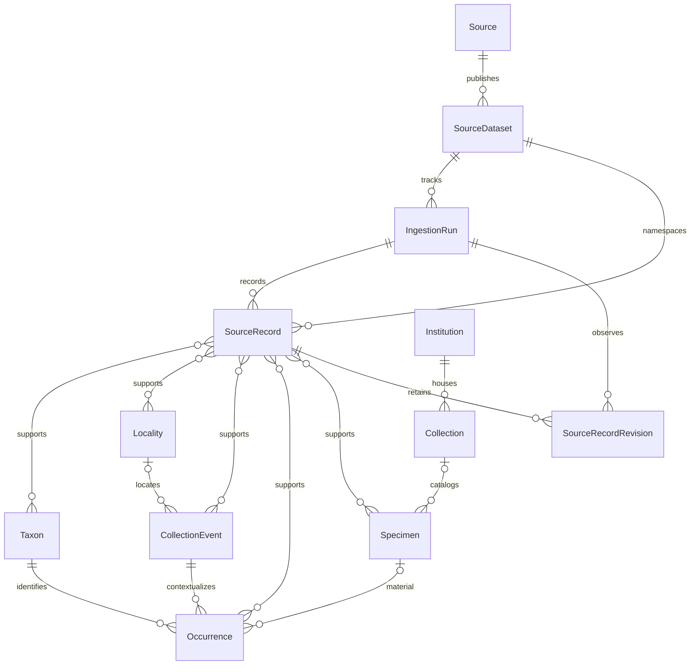

# Canonical, provenance and discovery model through Phase 3.5

Alembic `0002_explore_schema` implements eight entities and four evidence link tables.
`0003_ufvp_specimens` adds narrowly scoped museum material and revision entities;
see [ADR 0010](adr/0010-ufvp-material-and-snapshots.md).



## Identity and meaning

Entities use application-generated UUIDs and timezone-aware created/updated
timestamps. Fixture UUIDs have fixed v4 bits; ordinary inserts use `uuid4()`.
ORM updates maintain `updated_at`; direct SQL writers must do so too. Public
identity is the UUID. Names and optional future slugs are not permanent identity.

Occurrence links exactly one Taxon to one CollectionEvent. It is an evidence-supported
assertion, not a specimen. CollectionEvent owns source-specific age, stratigraphy,
and context and may reference a Locality. Locality represents a geographic place
and owns coordinates. Taxon names are navigation concepts, not a universal authority;
matching names do not trigger merging.

Specimen represents cataloged physical material, including catalog lots containing
multiple pieces. Institution and Collection describe custody; no global registry
is asserted. Occurrence.specimen_id is nullable to preserve nonmaterial assertions.
Specimen preserves original institution/collection/catalog codes, occurrenceID,
materialEntityID when supplied, other source identifiers, preparations and the
source individualCount string. Catalog triplets are deliberately not unique.
`specimen_evidence` uses real foreign keys and a composite primary key.

The UFVP adapter hashes dataset-scoped source IDs into deterministic UUIDs with v4
layout. These are opaque adapter identities, not random v4 IDs or globally
authoritative specimen identifiers. Catalog edits preserve identity; source core
ID changes create distinct assertions. Taxa group exact source classifications
including qualifiers; localities group exact source geographic metadata including
locationID. No fuzzy or cross-source matching occurs.

`taxon_evidence`, `locality_evidence`, `collection_event_evidence`, and
`occurrence_evidence` provide many-to-many mappings with composite primary keys and
real foreign keys. There is no unchecked polymorphic entity ID. The map requires
current occurrence evidence; detail also displays historical evidence. No general
write API exists. See [ADR 0009](adr/0009-occurrence-context-and-evidence.md).

## Provenance

Source identifies a provider (unique name). SourceDataset carries an external ID
scoped to its Source, title, publisher, URL, citation, DOI, license, rights holder,
version, publication/retrieval dates, and synthetic flag. NULL external dataset
IDs are permitted without claiming the datasets are identical.

IngestionRun records status, timestamps, nonnegative counts, source version, and
error summary. SourceRecord identity is scoped by
`(source_dataset_id, record_type, source_record_id)`. It retains raw JSONB, hash,
source URL/modification time, basis of record, license/rights/access metadata,
withholding/generalization notes, ingestion time, first/last seen, and current flag.
A composite foreign key prevents linking a record to another dataset's run.

Isolated automated fixtures represent synthetic snapshots. Real UFVP runs
record accepted counts, importer version, scope and snapshot JSONB (verified metadata,
archive URL, SHA-256, retained path and retrieval time). Archives are content addressed
and retained outside git. SourceRecordRevision stores each distinct row hash/raw JSONB
once with its first observing run. The importer never overwrites a revision; the
database does not install an immutable-row trigger. Reobservations update current
run/last_seen without duplicating material or revisions.

Only a successful complete Florida run deactivates unseen source records. Samples,
partial and failed runs do not; no canonical object is hard deleted. Current evidence
links follow the latest interpretation, while prior values remain in revisions/raw
archives. Detail reports the record's observing run version rather than the dataset's
newer current version. Raw payloads are not exposed by Explore; selected safe source
text fields are exposed separately from canonical interpretation.

## Geological age

Only CollectionEvent owns source-normalized `older_ma` and `younger_ma`; occurrences inherit
them. PostgreSQL NUMERIC has no fixed scale. Original early/late interval names remain
separate. Known bounds must be finite/nonnegative and older ≥ younger. Either may
be NULL; 0 is present, never unknown. JSON numbers are a presentation convenience,
not a precision claim.

`app/explore/queries.py:age_overlap` implements the central closed-interval rule:

```text
record.younger_ma <= selected.older_ma
AND record.older_ma >= selected.younger_ma
```

Both record bounds must be known. Endpoint contact counts. Without a filter,
unknown/partial intervals remain eligible; active filters exclude them rather
than guessing. API ranges require both finite ordered bounds within 0–10000 Ma
(an API guard, not a database definition). The frontend sends bounds and displays
backend results without independent age filtering.

`/api/v1/time-intervals` serves ICS v2026/06: 178 published concepts plus eight
separately cited formal subepoch compositions. The central attributed JSON retains
hierarchy, decimal calibration, uncertainty, GSSP metadata and CGMW colors. Two
verified RDF/PDF discrepancies are corrected transparently; see
[research](geological-timescale-research.md). These are calibrated reference envelopes,
not measured material ages. No formal Middle Pliocene or numeric NALMA range is invented.

UFVP source numeric bounds remain NULL. AgeInterpretation separately maps the finest
populated source age field (age, epoch, period, era) through conservative exact aliases.
Mixed/alternative/uncertain assertions are ambiguous; unsupported labels are unmapped;
missing assertions are absent. Unresolved finer labels never fall back to a broader
period. Original field/label, source content hash, policy version, rule, status,
reference interval and interpretation timestamp are retained. Application writes use
insert-on-conflict-do-nothing; no database immutability trigger is installed.

CatalogEntry chooses complete source numeric bounds when available, otherwise a
mapped reference envelope, otherwise no effective range. Its age_basis makes the
distinction explicit. Discovery applies the same inclusive overlap rule to effective
bounds. Active ranges exclude unresolved/partial ages; All ages includes them.
The legacy `/map/occurrences` still filters source bounds only; interactive Explore
uses `/map/places` and `/catalog` for derived filtering.

## Geography and queries

Locality.geom is the normalized authority: nullable `geometry(Point,4326)` with
GiST index. X is longitude (−180..180), Y latitude (−90..90); empty/invalid points
are rejected. Original coordinate strings, datum, nonnegative finite uncertainty
and precision, generalization, and withholding are separate metadata. Withheld
implies NULL geom. Unknown never becomes 0,0. API coordinates derive from geometry;
detail additionally suppresses withheld coordinates defensively.

Explore uses inclusive `ST_Intersects` with SRID-4326 envelopes. West > east splits
into west..180 OR −180..east. South ≤ north. World-spanning client views normalize
to −180..180. A zero-width envelope is a boundary query, not the whole world.
Generalized points remain selectable and visibly marked. No distance query exists.

Discovery joins typed catalog membership and uses current/nonsynthetic source evidence
with matching revision hash. Exact coordinate aggregates report total assertions,
distinct canonical localities, interpreted assertions and generalization status.
Aggregation never merges Locality identities or jitters coordinates. Spatial clusters
sum those assertion counts. Geometry GiST, foreign-key B-tree and catalog indexes
support query plans; the planner may choose sequential scans for broad small-sample
queries. Catalog/search/graph/place pages expose actual totals and stable keyset
cursors fingerprinted to active filters. Material without usable coordinates remains
searchable and inspectable in nonspatial context.

All public scientific queries exclude synthetic evidence. Coordinates normalize only
from accepted WGS84 aliases; unsupported/unknown datums remain unmapped, never guessed.

## Derived discovery entities

Migration `0004_discovery` adds six tables without replacing canonical entities:

| Entity | Identity and relationships |
| --- | --- |
| GeologicalInterval | Versioned reference key, parent FK, NUMERIC calibration, rank/color/reference JSONB |
| AgeInterpretation | Composite source-record/revision-hash/policy PK; composite revision FK and interval FK |
| TaxonPath | Composite leaf/ancestor Taxon FKs; only source-published classification membership |
| ContextTerm | Dataset-scoped deterministic UUID, exact source field/label, explicit namespace |
| CatalogEntry | Occurrence PK/FK; typed material/custody/locality/taxon/source and interpretation FKs |
| CatalogTerm | Composite occurrence/term FK membership, no unchecked polymorphic links |

Taxon gains dataset and nullable parent FKs. Published rank-prefix groups coexist
with existing source identification identities; matching names do not collapse them.
Missing ranks remain absent. The adapter never asserts accepted-name taxonomy.
ContextTerm distinguishes source geology, stratigraphy, NALMA and unclassified source
biochronology. Formation labels receive no inferred numerical age.

CatalogEntry is a transactional rebuildable projection with generated simple TSVECTOR,
GIN full-text/trigram, accession-prefix, effective-age and typed FK indexes. Source
raw JSON is read during explicit rebuilding, not interactive search. Historical age
interpretations survive rebuilds. Only current source content enters the projection.
The PostgreSQL discovery_uuid function supplies deterministic adapter UUID layout.

Graph responses are projections, not stored edges: canonical material/classification/
location/custody/source-term joins. Specimen-root edges have direct named meanings;
other roots explicitly show shared-material associations. Nodes have one of six
validated kinds, each resolved against a real table. Pagination balances kinds and
reports bounded totals. No Publication entity was introduced: audited UFVP core
contains no bibliographic fields. Dataset attribution is not a research relationship.

## Migration and deferred choices

0001 remains unchanged. 0002 creates tables in dependency order and reverses them
on downgrade. Downgrade loses application data; exercise it only on disposable DBs.
PostGIS is intentionally retained. Connections use `search_path=public` to keep
Tiger/topology schemas outside application autogeneration. Alembic ignores the
PostGIS-owned spatial_ref_sys and explicitly renders GeoAlchemy types.

0004 is additive and downgrades discovery before museum entities, retaining pg_trgm.
0003 is additive and downgrades museum entities before the older schema. Existing
0001 and 0002 remain unchanged. Downgrades belong only in disposable validation.
EntityIdentifier registries, merge redirects, field-level assertions, canonical
conflict preferences and cross-source reconciliation remain deferred. See
[UFVP ingestion](ufvp-ingestion.md) for normalization and lifecycle rules.

0005 adds `classification_link`, a rebuildable source-membership projection with
Taxon foreign keys, a primary taxon index, a parent index and a no-self-parent check.
It preserves the original source parent fields and connects the nearest supplied
rank across missing fields. Identification leaves remain distinct from prefix-rank
nodes even when labels repeat. Migration population and transactional discovery
refresh use the existing source paths; neither rewrites canonical museum assertions.
Lineage counts pass current-public membership and context, deduplicating specimens
across multiple identification assertions. Locality grouping uses canonical IDs;
exact-coordinate presentation aggregates never merge those identities.
